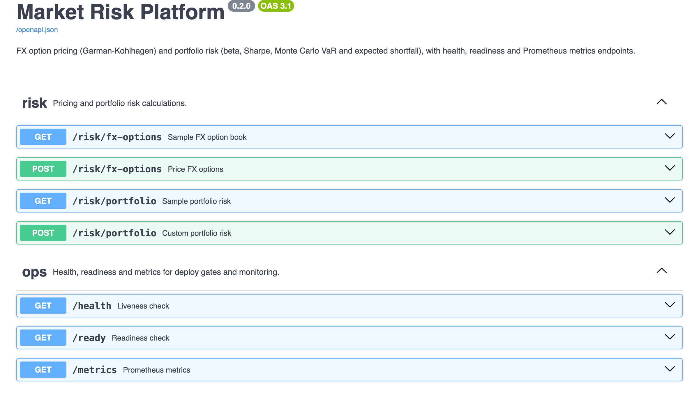
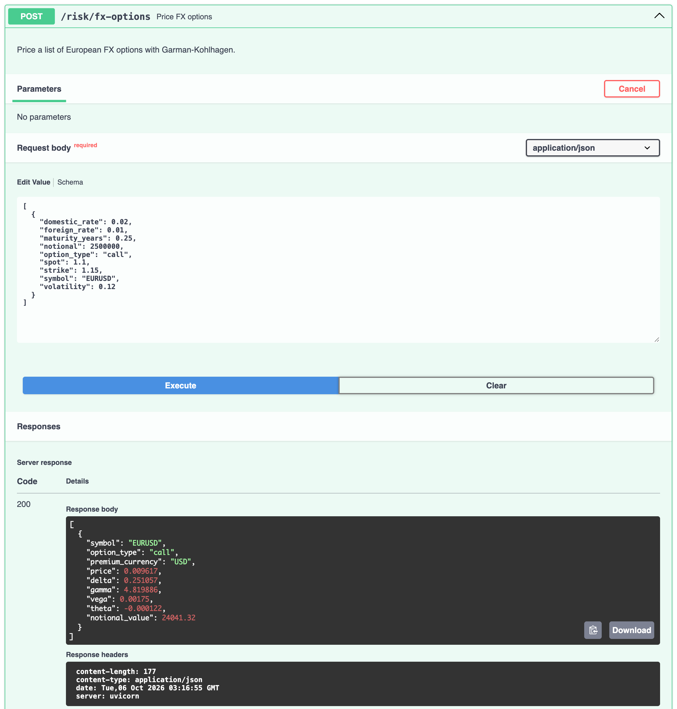
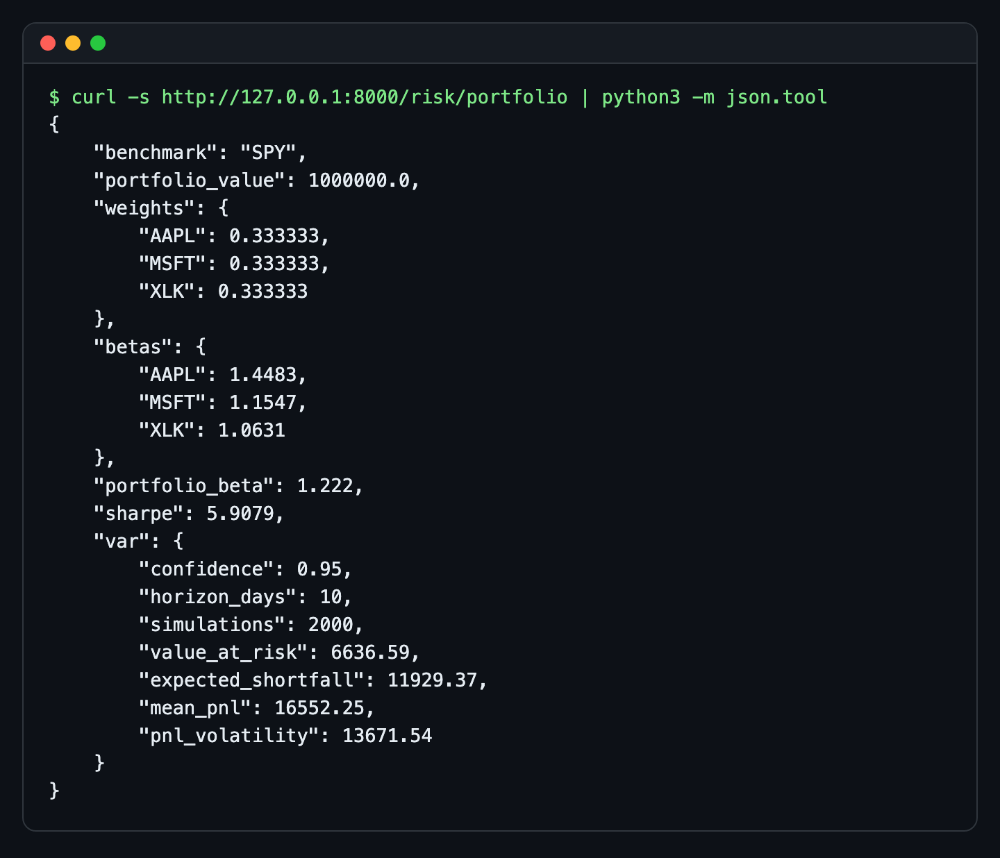
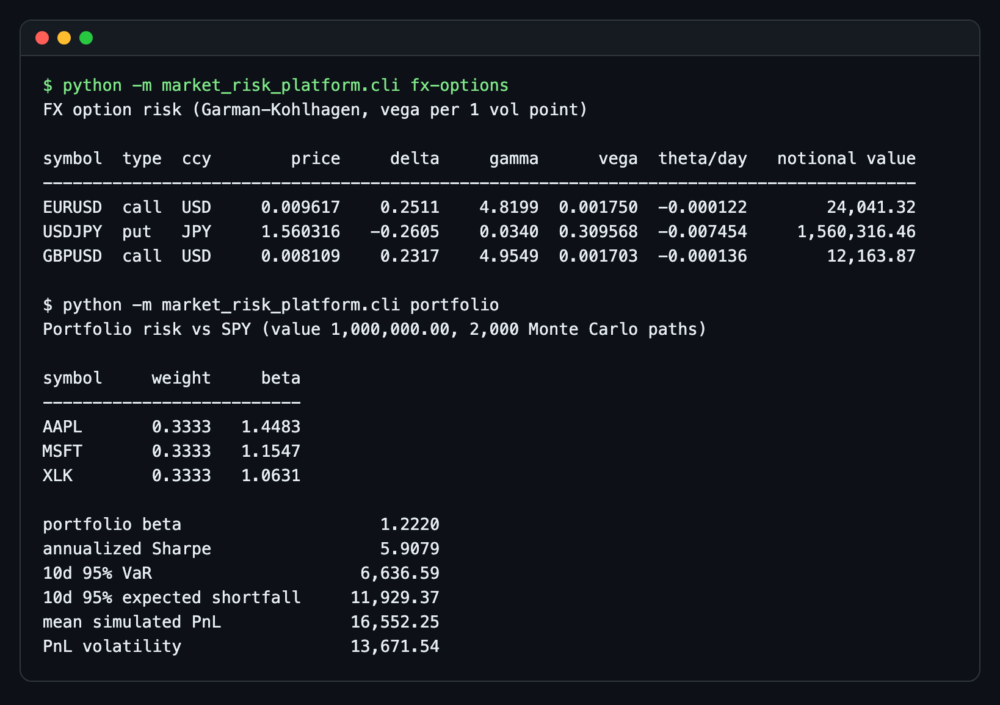
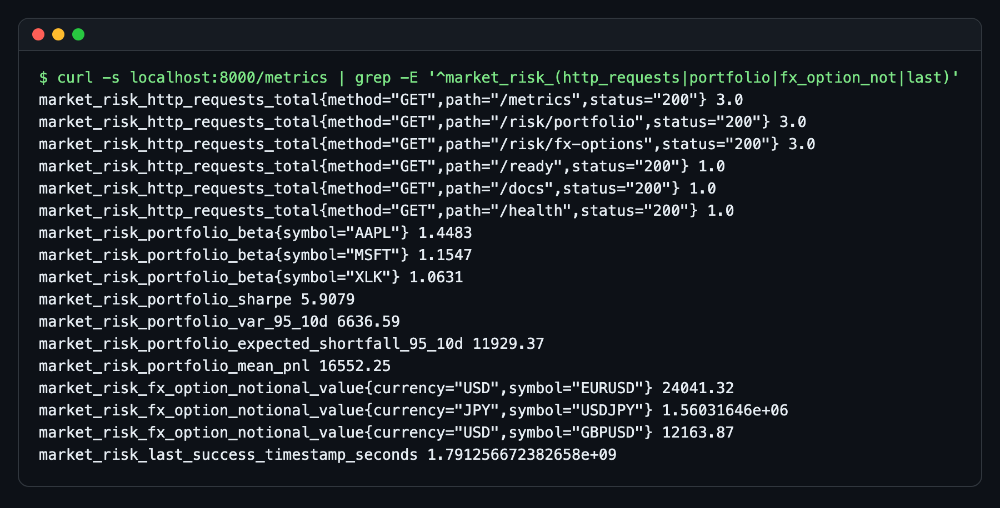
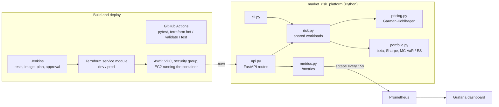

# Market Risk Platform

[](https://github.com/jovanshernandez/market-risk-platform/actions/workflows/ci.yml)

A small market-risk service and the platform around it. The Python core prices FX options with Garman-Kohlhagen (price, delta, gamma, vega, theta) and measures portfolio risk (beta, Sharpe, Monte Carlo VaR and expected shortfall). A FastAPI service exposes it with validated request models, liveness and readiness checks, and Prometheus metrics; a CLI runs the same workloads offline. Around it sit the pieces a trading-technology team would expect before running it for real: a container image, a Terraform service module with dev and prod environments and its own tests, CI, a Grafana dashboard, and runbook, SLO and security notes. The interesting part is less the math than the seams: one risk library feeding both the API and the CLI, metrics that are safe to scrape, and infrastructure that is tested without an AWS account.



| Pricing an option from Swagger UI | Portfolio risk over HTTP |
| --- | --- |
|  |  |

| CLI | Prometheus metrics |
| --- | --- |
|  |  |

## Features

- **FX option pricing**: Garman-Kohlhagen price and Greeks for European calls and puts, with the premium currency reported so USD and JPY values are never summed by accident.
- **Portfolio risk**: per-asset and portfolio beta against a benchmark, annualized Sharpe, and Monte Carlo VaR and expected shortfall at any confidence and horizon, seeded for reproducibility.
- **API**: FastAPI with pydantic request and response models. `GET` endpoints run the bundled sample book; `POST` endpoints take your own options or portfolio. Bad input gets a 422 with the reason.
- **Operability**: `/health` for liveness, `/ready` (returns 503 when the risk checks fail) for deploy gates, `/metrics` in Prometheus format with request counts, a latency histogram, risk gauges, and a last-success timestamp for freshness alerts.
- **Infrastructure**: Terraform module for a VPC, subnet, security group and EC2 host (IMDSv2, encrypted root volume, ingress closed by default) with dev and prod environments and `terraform test` coverage against a mocked AWS provider.
- **Delivery**: GitHub Actions runs the tests and Terraform checks on every push; a Jenkinsfile models the longer path with image build, plan archive and a manual production gate.
- **Observability**: Prometheus scrape config and a provisioned Grafana dashboard (availability, VaR, ES, betas, Greeks, request rate, p95 latency, 5xx ratio, data freshness).

## Architecture



The risk math has no web or I/O dependencies, so it is unit tested directly. `risk.py` turns it into the two workloads (FX option book, portfolio) and returns pydantic models, which the API serves as JSON and the CLI prints as tables or JSON. See [docs/architecture.md](docs/architecture.md).

## Quick start

Requires Python 3.12 or newer. From the repository root:

```bash
python3 -m venv .venv
source .venv/bin/activate
pip install -r app/requirements-dev.txt
cd app
```

Run the CLI:

```bash
python -m market_risk_platform.cli fx-options
python -m market_risk_platform.cli portfolio
python -m market_risk_platform.cli portfolio --confidence 0.99 --horizon-days 5 --simulations 10000 --json
```

Start the API (or run `scripts/run-local.sh` from the repo root, which creates the venv and starts it with reload):

```bash
uvicorn market_risk_platform.api:app --host 127.0.0.1 --port 8000
```

Then open <http://127.0.0.1:8000/docs> for the interactive API docs.

### With Prometheus and Grafana (needs Docker)

`docker-compose.yml` starts the API, Prometheus and Grafana together. It needs Docker Desktop or another Docker engine (for example Colima on macOS).

```bash
docker compose up --build
```

- API docs: <http://127.0.0.1:8000/docs>
- Prometheus: <http://127.0.0.1:9090>
- Grafana: <http://127.0.0.1:3000/d/market-risk-overview/market-risk-platform-overview> (admin / admin, local only)

Without Docker, [docs/observability.md](docs/observability.md) has the native Homebrew setup using `observability/prometheus/prometheus.local.yml` and `observability/grafana/provisioning-local/`.

## API examples

With the server running on port 8000:

```bash
# Sample book
curl -s http://127.0.0.1:8000/risk/fx-options
curl -s http://127.0.0.1:8000/risk/portfolio

# Price your own options
curl -s -X POST http://127.0.0.1:8000/risk/fx-options \
  -H 'Content-Type: application/json' \
  -d '[{"symbol": "EURUSD", "spot": 1.10, "strike": 1.12, "maturity_years": 0.5,
        "domestic_rate": 0.04, "foreign_rate": 0.025, "volatility": 0.09,
        "option_type": "put", "notional": 5000000}]'

# Risk for your own portfolio: 99% 10-day VaR on a 60/40 mix
curl -s -X POST http://127.0.0.1:8000/risk/portfolio \
  -H 'Content-Type: application/json' \
  -d '{"portfolio_value": 2000000, "confidence": 0.99, "horizon_days": 10,
       "benchmark_returns": [0.004, -0.002, 0.006, 0.001, -0.005, 0.003],
       "assets": [
         {"symbol": "AAPL", "weight": 0.6, "daily_returns": [0.006, -0.003, 0.009, 0.002, -0.008, 0.004]},
         {"symbol": "MSFT", "weight": 0.4, "daily_returns": [0.005, -0.002, 0.007, 0.001, -0.006, 0.004]}
       ]}'

# Ops endpoints
curl -s http://127.0.0.1:8000/health
curl -s http://127.0.0.1:8000/ready
curl -s http://127.0.0.1:8000/metrics
```

| Endpoint | What it returns |
| --- | --- |
| `GET /risk/fx-options` | Price and Greeks for the sample EURUSD, USDJPY and GBPUSD options |
| `POST /risk/fx-options` | Price and Greeks for a list of options you send (1 to 500) |
| `GET /risk/portfolio` | Betas, Sharpe, 10-day 95% VaR and ES for the sample AAPL / MSFT / XLK book |
| `POST /risk/portfolio` | The same for your weights and return series, confidence and horizon |
| `GET /health` | `{"status": "ok"}` while the process is serving |
| `GET /ready` | Runs both workloads; 200 when results are usable, 503 otherwise |
| `GET /metrics` | Prometheus exposition format |

## How it works

**Garman-Kohlhagen.** An FX option is a Black-Scholes option where the foreign currency pays a continuous "dividend" equal to its interest rate. For a pair quoted `BASEQUOTE`, the base currency is foreign (rate `rf`) and the quote currency is domestic (rate `rd`), so the price comes out in quote currency per unit of base notional. `delta` is spot delta, `gamma` is per 1.00 move in spot, `vega` is per 1 vol point (0.01), and `theta` is per calendar day. The tests check a textbook reference price, put-call parity, and every Greek against finite differences.

**Beta and Sharpe.** Beta is the covariance of an asset's daily returns with the benchmark's, divided by the benchmark's variance; portfolio beta is the weight-averaged asset beta. Sharpe is mean daily return over its standard deviation, scaled by the square root of 252 trading days.

**Monte Carlo VaR and expected shortfall.** The portfolio's daily returns are fitted with a normal distribution, and each simulated path compounds `horizon_days` random daily returns on the portfolio value. VaR at 95% is the loss at the 5th percentile of simulated PnL; expected shortfall is the average loss across that worst 5%, so it is always at least the VaR and says how bad the tail is, not just where it starts. Runs are seeded, and a request may ask for at most one million path-days so one call can't hog the worker. The tests check that the simulation converges to the closed-form normal VaR. [docs/tradeoffs.md](docs/tradeoffs.md) covers why normal returns understate fat tails.

**Metrics.** Request counters and the latency histogram are labeled by route template (`/risk/portfolio`), never the raw URL, and unmatched paths share one `unmatched` label, so a scanner can't blow up label cardinality. Risk gauges are recomputed on each scrape and stamp `market_risk_last_success_timestamp_seconds`, which the dashboard turns into a freshness panel.

**Infrastructure.** The Terraform module provisions a VPC, public subnet, security group and an EC2 host that runs a pinned container image. Defaults lean safe: IMDSv2 required, encrypted root volume, and no API or SSH ingress unless CIDR blocks are passed in. `dev` validates without a backend; `prod` shows an S3 remote-state and DynamoDB-lock pattern with placeholder names. Nothing in this repo applies infrastructure.

## Testing

```bash
# Python: pricing, portfolio math, API and CLI (from app/, venv active)
python -m pytest -q

# Terraform: formatting, environment validation, module tests with a mocked AWS provider
terraform fmt -check -recursive infra/terraform
(cd infra/terraform/environments/dev && terraform init -backend=false && terraform validate)
(cd infra/terraform/modules/service && terraform init && terraform test)
```

Run the Terraform commands from the repository root. `terraform test` needs Terraform 1.7 or newer; it uses `mock_provider "aws"`, so it needs no credentials and makes no AWS calls. GitHub Actions ([.github/workflows/ci.yml](.github/workflows/ci.yml)) runs all of the above on Python 3.12 and Terraform 1.16, plus validation of the prod environment.

## Project layout

```text
app/
  market_risk_platform/
    api.py            FastAPI routes and request-metrics middleware
    cli.py            Command-line entry point
    metrics.py        Prometheus registry, counters, histogram, risk gauges
    models.py         Domain dataclasses (FX option position, risk result)
    portfolio.py      Beta, Sharpe, Monte Carlo VaR / ES
    pricing.py        Garman-Kohlhagen pricing and Greeks
    risk.py           Workloads shared by the API and CLI
    sample_data.py    Deterministic sample FX book and return series
    schemas.py        Pydantic request / response models
  tests/              pytest suite
  Dockerfile
  requirements.txt    Runtime dependencies (used by the image)
  requirements-dev.txt
ci/Jenkinsfile        Delivery pipeline with plan archive and production gate
infra/terraform/
  modules/service/    Reusable AWS service module, plus tests/ for terraform test
  environments/dev/   Backendless environment for validation
  environments/prod/  Remote-state pattern
observability/        Prometheus config, Grafana provisioning and dashboard
docs/                 Architecture, observability, platform, runbook, security, SRE, tradeoffs
scripts/run-local.sh  Create the venv and start the API with reload
```

## Further reading

- [Architecture](docs/architecture.md)
- [Observability](docs/observability.md): every metric and dashboard panel
- [Platform notes](docs/platform.md)
- [Runbook](docs/runbook.md)
- [Security](docs/security.md)
- [SRE notes and SLOs](docs/sre.md)
- [Tradeoffs](docs/tradeoffs.md)
